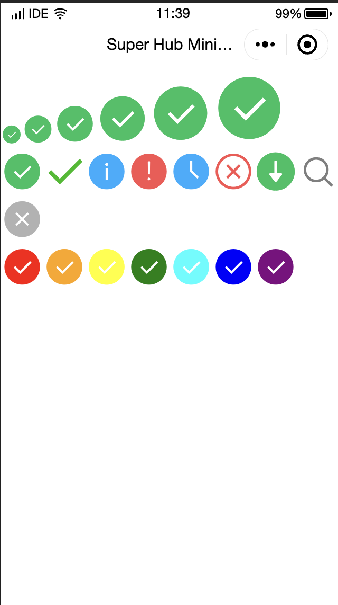

# Icon 
*** 

| Attribute  | Type          | Default Value | Required | Description                                                                                                                             |
| :--------- | :------------ | :------------ | :------- | :-------------------------------------------------------------------------------------------------------------------------------------- |
| type       | String        |               | Yes      | Icon type. The valid values are: `success`, `success_no_circle`, `info`, `warn`, `waiting`, `cancel`, `download`, `search` and `clear`. |
| size       | Number/String | 23            | No       | Icon size in px.                                                                                                                        |
| color      | String        |               | No       | Icon color, which uses the same color specifications of CSS.                                                                            |
| aria-label | String        |               | No       | Accessibility, which is the additional description of the element.                                                                      |

### Sample code

```javascript
// JavaScript
Page({
	data: {
    iconSize: [20, 30, 40, 50, 60, 70],
    iconColor: [
      'red', 'orange', 'yellow', 'green', 'rgb(0,255,255)', 'blue', 'purple'
    ],
    iconType: [
      'success', 'success_no_circle', 'info', 'warn', 'waiting', 'cancel', 'download', 'search', 'clear'
    ]
  }
})
```
```xml
<!--WXML-->

<view class="group">
  <block wx:for="{{iconSize}}">
    <icon type="success" size="{{item}}" />
  </block>
</view>
<view class="group">
  <block wx:for="{{iconType}}">
 		<icon type="{{item}}" size="40" />
  </block>
</view>
<view class="group">
  <block wx:for="{{iconColor}}">
  	<icon type="success" size="40" color="{{item}}" />
  </block>
</view>


```


