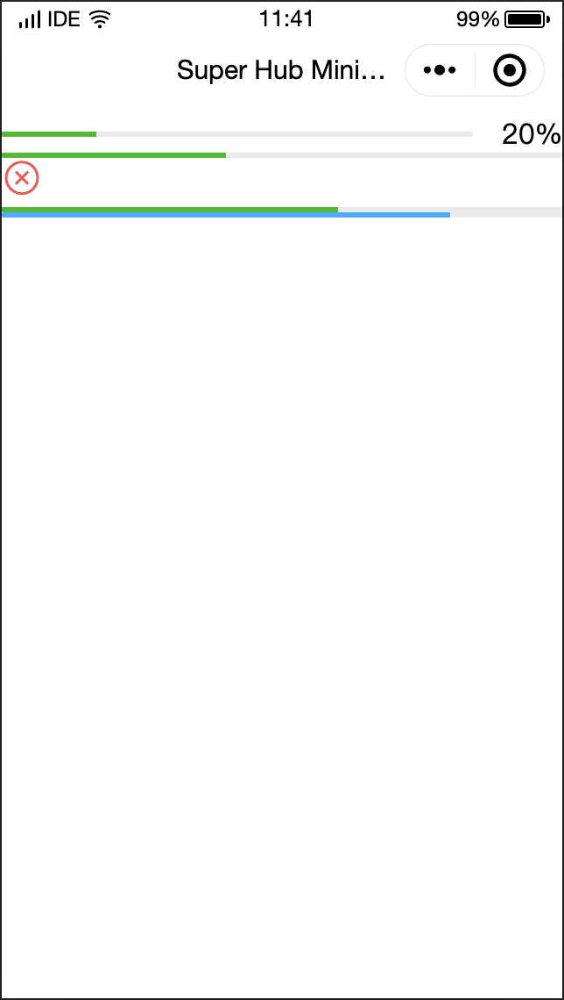

# Progress 
*** 

| Attribute | Type | Default Value | Required | Description |
| :-------- | :--- | :------------ | :------- | :---------- |
| percent | Number |  | No | Percentage between 0 and 100. |
| show-info | Boolean | false | No | Whether to show the percentage on the right of the progress bar. |
| border-radius | Number/String | 0 | No | Rounded corner size in px. |
| font-size | Number/String | 16 | No | Font size in px of the percentage displayed on the right. |
| stroke-width | Number/String | 6 | No | Progress bar width in px. |
| color | String | # 09BB07 | No | Progress bar color (use active Color) |
| activeColor | String | # 09BB07 | No | Color of the progress bar indicator. |
| backgroundColor | String | # EBEBEB | No | Color of the progress bar track. |
| active | Boolean | false | No | Progress bar animation moving from left to right. |
| active-mode | String | backwards | No | `backwards`: Plays the animation from the start.  \n`forwards`: Plays the animation from where it ended. |
| bindactiveend | Event handler |  | No | Animation completion event. |
| aria-label | String |  | No | Accessibility, which is the additional description of the element. |


### Sample code

```xml
<!--WXML-->

<view class="progress-box">
  <progress percent="20" show-info stroke-width="3"/>
</view>

<view class="progress-box">
  <progress percent="40" active stroke-width="3" />
  <icon class="progress-cancel" type="cancel"></icon>
</view>

<view class="progress-box">
  <progress percent="60" active stroke-width="3" />
</view>

<view class="progress-box">
  <progress percent="80" color="#10AEFF" active stroke-width="3" />
</view>

```


