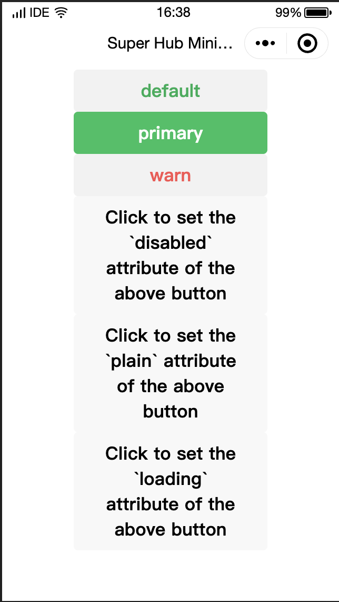

# Button 
Button is an interactive element activated when a user taps it.
*** 
Button component is triggered by the user to perform an action such as submitting a form or opening a dialog box.

| Attribute              | Type    | Default Value | Description                                                                                                       |
| :--------------------- | :------ | :------------ | :---------------------------------------------------------------------------------------------------------------- |
| size                   | String  |               | Button size.                                                                                                      |
| type                   | String  |               | Button style type.                                                                                                |
| plain                  | Boolean | false         | Whether to set the button to hollow-carved (i.e., transparent background)                                         |
| disabled               | Boolean | false         | Whether it is disabled.                                                                                           |
| loading                | Boolean | false         | Whether to display a loading icon before the button text.                                                         |
| form-type              | String  |               | `submit` or `reset` events of the `<form>` component when the user clicks the button.                             |
| hover-class            | String  | button-hover  | Style class when the user clicks the button. If `hover-class="none"` is set, there will be no click state effect. |
| hover-stop-propagation | Boolean | false         | Whether to prevent the ancestor node of this node from getting the click event.                                   |
| hover-start-time       | Number  | 20            | How long in milliseconds the click state is triggered after the screen is pressed.                                |
| hover-stay-time        | Number  | 70            | Click state retention period in milliseconds after the user lifts the finger.                                     |
| lang                   | String  | en            | Language of the user information to be returned.                                                                  |

### Size valid value

| Value   | Description   |
| :------ | :------------ |
| default | Default Size. |
| mini    | Small size.   |

### Type valid value

| Value   | Description |
| :------ | :---------- |
| primary | green       |
| default | white       |
| warn    | red         |

### Form-type valid value

| Value  | Description  |
| :----- | :----------- |
| submit | Submit form. |
| reset  | Reset form.  |

### Sample code

```xml
// WXML

<button
  type="default"
  size="{{defaultSize}}"
  loading="{{loading}}"
  plain="{{plain}}"
  disabled="{{disabled}}"
  bindtap="default"
  hover-class="other-button-hover">
	default
</button>
<button
  type="primary"
  size="{{primarySize}}"
  loading="{{loading}}"
  plain="{{plain}}"
  disabled="{{disabled}}"
  bindtap="primary">
	primary
</button>
<button
  type="warn"
  size="{{warnSize}}"
  loading="{{loading}}"
  plain="{{plain}}"
  disabled="{{disabled}}"
  bindtap="warn">
	warn
</button>
<button bindtap="setDisabled">Click to set the `disabled` attribute of the above button</button>
<button bindtap="setPlain">Click to set the `plain` attribute of the above button</button>
<button bindtap="setLoading">Click to set the `loading` attribute of the above button</button>
	Loading
</button>

```
```css
// WXSS
/** wxss **/
/** Modify the default style class of the click state of `button`**/
.button-hover {
	background-color: red;
}
/** Add a custom style class of the click state of `button`**/
.other-button-hover {
	background-color: blue;
}
```


