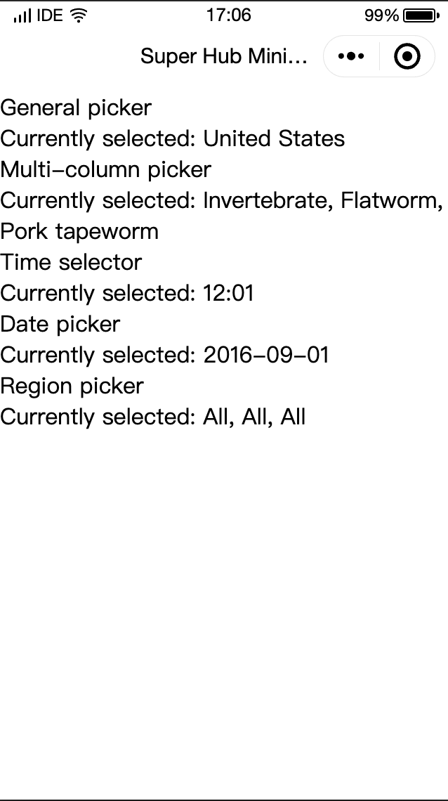

# Picker 
A wheel selector that pops up from the bottom.

***

Currently, five pickers are supported and are identified by mode : general picker (default), multicolumn picker, time picker, date picker, and region picker.

| Attribute | Type | Default Value | Required | Description |
| :-------- | :--- | :------------ | :------- | :---------- |
| range | Array/Object Array |  | No | range will take effect if `mode` is `selector` or `multiSelector`. |
| range-key | String |  | No | If `range` is an object array, use `range-key` to specify key values in the object array to be displayed in the picker. |
| value | Number | 0 | No | The number of the element selected from `range` (the subscript starts from 0) |
| disabled | Boolean | false | No | Whether it is disabled. |
| bindchange | Event Handler |  | No | The `change` event triggered when `value` changes: `event.detail = {value: value}` |
| bindcancel | Event Handler |  | No | The event triggered when the user deselects or clicks the mask layer to collapse the picker. |

### Mode valid value

| Value         | Description                |
| :------------ | :------------------------- |
| selector      | Common selector.           |
| multiSelector | multi-column selector.     |
| time          | Time selector.             |
| date          | Date picker.               |
| region        | Provincial urban selector. |

In addition to the general properties above, for different modes, **Picker** have different properties.

**Common selector**: `mode = selector`.

| Attribute        | Type               | Description                                                                                                               |
| :--------------- | :----------------- | :------------------------------------------------------------------------------------------------------------------------ |
| range            | Array/Object Array | Mode for selector or multi-selector effective range.                                                                      |
| range-key        | String             | The range-key is specified as an Object Array. When you specify Object in a range key, it displays content as a selector. |
| value            | Array              | Indicate that you have chosen to define the range value whose subscript is derived from the 0 Start.                      |
| bindchange       | Event Handler      | It is triggered when changed change Event, `event.detail = {value}`.                                                      |
| bindcolumnchange | Event Handler      | It is triggered when column changes.                                                                                      |

**Multiple column selector**: `mode = multiSelector`

| Attribute        | Type               | Required | Description                                                                                                               |
| :--------------- | :----------------- | :------- | :------------------------------------------------------------------------------------------------------------------------ |
| range            | Array/Object Array | no       | Mode for selector or multi-selector effective range.                                                                      |
| range-key        | String             |          | The range-key is specified as an Object Array. When you specify Object in a range key, it displays content as a selector. |
| value            | Array              |          | Indicate that you have chosen to define the range value whose subscript is derived from the 0 Start.                      |
| bindchange       | Event Handler      |          | It is triggered when changed change Event, `event.detail = {value}`.                                                      |
| bindcolumnchange | Event Handler      |          | It is triggered when column changes.                                                                                      |

**Time picker:** `mode = time`

| Attribute  | Type          | Description                                                                      |
| :--------- | :------------ | :------------------------------------------------------------------------------- |
| value      | String        | Indicates the selected time in the format "hh: mm".                              |
| start      | String        | Represents the beginning of a valid time range, with the string format "hh: mm". |
| end        | String        | Represents the end of a valid time range, with the string format "hh: mm".       |
| bindchange | Event Handler | value triggered when the change Event, `event.detail = {value}` is changed.      |

**Date picker:** `mode = date`.

| Attribute  | Type          | Default Value | Description                                                                          |
| :--------- | :------------ | :------------ | :----------------------------------------------------------------------------------- |
| value      | String        | Same day      | Represents the selected date in the format "YYYY-MM-DD".                             |
| start      | String        |               | Represents the start of a valid date range, with a string format of "YYYY-MM-DD".    |
| end        | String        |               | Represents the end of a valid date range in the string format "YYY-MM-DD".           |
| fields     | String        | day           | Valid value for year, month, and day. It represents the granularity of the selector. |
| bindchange | Event Handler |               | value triggered when the change Event, `event.detail = {value}` is changed.          |

**Fields valid value:**

| Value | Description                    |
| :---- | :----------------------------- |
| year  | Selector granularity is year.  |
| month | Selector granularity is month. |
| day   | Selector granularity is day.   |

**Region picker: mode = region**

| Attribute   | Type          | Description                                                                                                                                                                       |
| :---------- | :------------ | :-------------------------------------------------------------------------------------------------------------------------------------------------------------------------------- |
| value       | Array         | Represents the selected province, with the first value in each column selected by default.                                                                                        |
| custom-item | String        | You can add a custom item to the top of each column.                                                                                                                              |
| bindchange  | Event Handler | value Triggered when the change Event, `event.detail = {value, code, Postcode}` is changed and where the fields code is a statistical zoning code and the postcode is a zip code. |

### Sample code

```javascript
// JavaScript
Page({
  data: {
    array: ['United States', 'China', 'Brazil', 'Japan'],
    objectArray: [
      {
        id: 0,
        name: 'United States'
      },
      {
        id: 1,
        name: 'China'
      },
      {
        id: 2,
        name: 'Brazil'
      },
      {
        id: 3,
        name: 'Japan'
      }
    ],
    index: 0,
    multiArray: [['Invertebrate', 'Vertebrate'], ['Flatworm', 'Roundworm', 'Annelid', 'Mollusca', 'Arthropod'], ['Pork tapeworm', 'Bloodfluke']],
    objectMultiArray: [
      [{
        id: 0,
        name: 'Invertebrate'
      },
      {
        id: 1,
        name: 'Vertebrate'
      }
      ], [{
        id: 0,
        name: 'Flatworm'
      },
      {
        id: 1,
        name: 'Roundworm'
      },
      {
        id: 2,
        name: 'Annelid'
      },
      {
        id: 3,
        name: 'Mollusca'
      },
      {
        id: 3,
        name: 'Arthropod'
      }
      ], [{
        id: 0,
        name: 'Pork tapeworm'
      },
      {
        id: 1, name: 'Blood fluke'
      }
      ]],
    multiIndex: [0, 0, 0],
    date: '2016-09-01',
    time: '12:01',
    region: ['Guangdong Province', 'Guangzhou', 'Haizhu District'],
    customItem: 'All'
  },
  bindPickerChange(e) {
    console.log('The value selected by the picker changed, and the carried value is ', e.detail.value)
    this.setData({
      index: e.detail.value
    })
  },
  bindMultiPickerChange(e) {
    console.log('The value selected by the picker changed, and the carried value is ', e.detail.value)
    this.setData({
      multiIndex: e.detail.value
    })
  },
  bindMultiPickerColumnChange(e) {
    console.log('The column ', e.detail.column, ' was changed, and the value is ', e.detail.value)
    const data = {
      multiArray: this.data.multiArray,
      multiIndex: this.data.multiIndex
    }
    data.multiIndex[e.detail.column] = e.detail.value
    switch (e.detail.column) {
      case 0:
        switch (data.multiIndex[0]) {
          case 0:
            data.multiArray[1] = ['Flatworm', 'Roundworm', 'Annelid', 'Mollusca', 'Arthropod']
            data.multiArray[2] = ['Pork tapeworm', 'Blood fluke']
            break
          case 1:
            data.multiArray[1] = ['Fish', 'Amphibian', 'Reptile']
            data.multiArray[2] = ['Crucian carp', 'Hairtail']
            break
        }
        data.multiIndex[1] = 0
        data.multiIndex[2] = 0
        break
      case 1:
        switch (data.multiIndex[0]) {
          case 0:
            switch (data.multiIndex[1]) {
              case 0:
                data.multiArray[2] = ['Pork tapeworm', 'Blood fluke']
                break
              case 1:
                data.multiArray[2] = ['Ascaris lumbricoides']
                break
              case 2:
                data.multiArray[2] = ['Ant', 'Leech']
                break
              case 3:
                data.multiArray[2] = ['Freshwater mussel', 'Snail', 'Slug']
                break
              case 4:
                data.multiArray[2] = ['Insect', 'Crustacean', 'Arachnida', 'Myriapoda']
                break
            }
            break
          case 1:
            switch (data.multiIndex[1]) {
              case 0:
                data.multiArray[2] = ['Crucian carp', 'Hairtail']
                break
              case 1:
                data.multiArray[2] = ['Frog', 'Salamander']
                break
              case 2:
                data.multiArray[2] = ['Lizard', 'Turtle', 'Gecko']
                break
            }
            break
        }
        data.multiIndex[2] = 0
        break
    }
    console.log(data.multiIndex)
    this.setData(data)
  },
  bindDateChange(e) {
    console.log('The value selected by the picker changed, and the carried value is ', e.detail.value)
    this.setData({
      date: e.detail.value
    })
  },
  bindTimeChange(e) {
    console.log('The value selected by the picker changed, and the carried value is ', e.detail.value)
    this.setData({
      time: e.detail.value
    })
  },
  bindRegionChange(e) {
    console.log('The value selected by the picker changed, and the carried value is ', e.detail.value)
    this.setData({
      region: e.detail.value
    })
  }
})
```
```xml
<!--WXML-->

<view class="section">
  <view class="section__title">Common selector</view>
  <picker bindchange="bindPickerChange" value="{{index}}" range="{{array}}">
    <view class="picker">
      Current selection: {{array[index]}}
    </view>
  </picker>
</view>
<view class="section">
  <view class="section__title">Multi-column selector</view>
  <picker mode="multiSelector" bindchange="bindMultiPickerChange" bindcolumnchange="bindMultiPickerColumnChange" value="{{multiIndex}}" range="{{multiArray}}">
    <view class="picker">
      Current selection: {{MultiArray[0][multiIndex[0]]}}，{{multiArray[1][multiIndex[1]]}}，{{multiArray[2][multiIndex[2]]}}
    </view>
  </picker>
</view>
<view class="section">
  <view class="section__title">Time selector</view>
  <picker mode="time" value="{{time}}" start="09:01" end="21:01" bindchange="bindTimeChange">
    <view class="picker">
      Current Selection: {{time}}
    </view>
  </picker>
</view>

<view class="section">
  <view class="section__title">Date picker</view>
  <picker mode="date" value="{{date}}" start="2015-09-01" end="2017-09-01" bindchange="bindDateChange">
    <view class="picker">
      Current Selection: {{date}}
    </view>
  </picker>
</view>
<view class="section">
  <view class="section__title">Provincial urban selector</view>
  <picker mode="region" bindchange="bindRegionChange" value="{{region}}" custom-item="{{customItem}}">
    <view class="picker">
      Current selection: {{region[0]}}，{{region[1]}}，{{region[2]}}
    </view>
  </picker>
</view>

```


