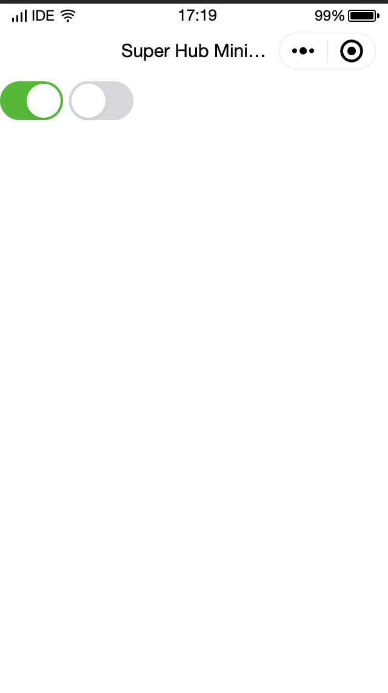

# Switch 
Used for switching between two states; on and off.

***

A switch component functions similar to a checkbox component but explicitly representing boolean on and off states.

| Attribute  | Type         | Default Value | Required | Description                                                                                                           |
| :--------- | :----------- | :------------ | :------- | :-------------------------------------------------------------------------------------------------------------------- |
| checked    | Boolean      | false         | No       | Whether it is selected.                                                                                               |
| disabled   | Boolean      | false         | No       | Whether it is disabled.                                                                                               |
| type       | String       | switch        | No       | Style. Valid values: `switch`, `checkbox`.                                                                            |
| color      | String       | # 04BE02      | No       | Switch color, which uses the same color specifications of CSS.                                                        |
| bindchange | Eventhandler |               | No       | This event is triggered when the value of checked changes: Events, `event.detail ={value}`.                           |
| aria-label | String       |               | No       | The `change` event triggered when the component is clicked and the value of `checked` changes: `event.detail={value}` |

### Sample code

```javascript
// JavaScript
Page({
  switch1Change(e) {
  	console.log('A change event occurred in `switch1`, and the carried value is ', e.detail.value)
  },
  switch2Change(e) {
  	console.log('A change event occurred in `switch2`, and the carried value is ', e.detail.value)
  }
})
```
```xml
<!--WXML-->

<view class="body-view">
  <switch checked bindchange="switch1Change" />
  <switch bindchange="switch2Change" />
</view>

```

> 📘 Notes
> 
> - Changing the switch type will generate the vibration feedback on iOS, which can be disabled from "Settings" > "Sounds & Haptics" > "System Haptics".


