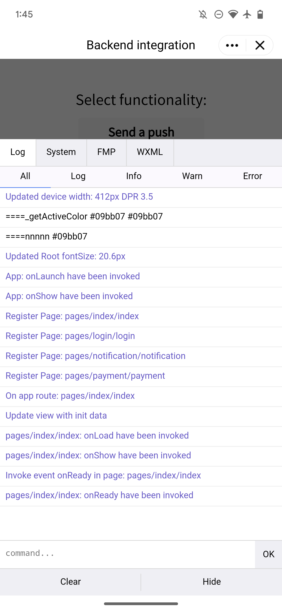

# vConsole 
*** 
On a real device, if you want to view the log content and additional debugging information output by the console API, you need to click the button in  
the top-right corner to open the menu and select Enable Debugging. Then, the mini app will exit, and after it is reopened, a vConsole button will appear in the bottom-right corner. Click vConsole to open the log panel.

The vConsole display of the mini app is as follows:

### vConsole instructions

Due to the limitations of the implementation mechanism, the log content printed by calling the console API is converted into a JSON string and then transferred to the vConsole. Therefore, there are some restrictions on the content displayed in the vConsole:

- Except for Number , String , Boolean , and null , other types will be processed and displayed as Object, and the object and the Enumerable  
  attribute in the prototype chain will be printed.
- Infinity and NaN will be displayed as null .
- Data of undefined, ArrayBuffer, and Function types cannot be displayed.  
  Objects with circular references cannot be printed.

> 📘 Note
> 
> Avoid printing too complicated or lengthy logs in non-debugging scenarios; otherwise, additional time overheads may be incurred.
