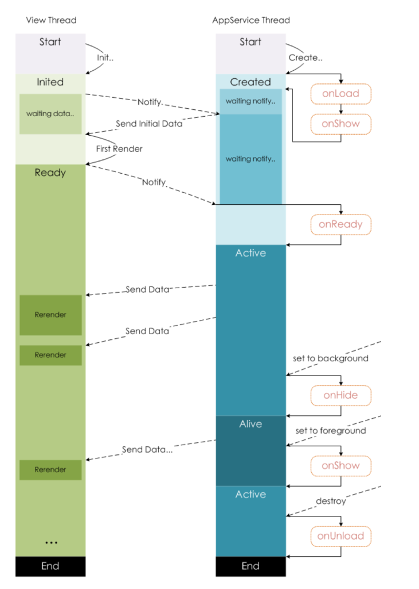

# Logic Layer 
*** 
## Logic Layer (App Service)

The logic layer of the Mini App development framework uses the `JavaScript` engine to provide a runtime environment for your JavaScript code and the unique features of the Super Hub Mini App.

The logic layer processes the data and sends it to the view layer and receives the event feedback from the view layer at the same time.

All the code you write will eventually be packaged into a `JavaScript` file and executed when the Mini App is started until the Mini App is terminated. This behavior is similar to [ServiceWorker](https://developer.mozilla.org/en-US/docs/Web/API/Service_Worker_API/Using_Service_Workers), so the logic layer is also called App Service.

On the basis of JavaScript , some features have been added to facilitate Mini App development:

- [App](logic-layer-section#appobject) and [Page](logic-layer-section#page) methods are added to register apps and pages respectively.
- `getApp` and `getCurrentPages` methods are added to get the App instance and current page stack respectively.
- Rich [APIs](../../apis) unique to Super Hub are provided, such as user data acquisition, QR code scan, and payment.
- Each page has an independent [scope](page-routing#file-scope), and [module](page-routing#module) capabilities are provided.

> 📘 Note
> 
> Note: The logic layer of the Mini App framework does not run in browsers, so some capabilities of `JavaScript` cannot be used on the web, such as `window` and `document` .

## Mini App

### App(Object)

The `App()` function is used to register a Mini App. It accepts an Object parameter that specifies lifecycle callbacks for the Mini App.

**`App()` must be called in `app.js` once and only once; otherwise, there will be unpredictable consequences.**

**`Object` parameter description:**

| Attribute                                                      | Type     | Description                                                                                   | Trigger Time                                                                                          |
| :------------------------------------------------------------- | :------- | :-------------------------------------------------------------------------------------------- | :---------------------------------------------------------------------------------------------------- |
| [onLaunch](logic-layer-section#onlaunchobject)             | Function | Lifecycle callback for listening for Mini App initialization                                  | Triggered when the initialization of the mini app is completed (triggered only once globally).        |
| [onShow](logic-layer-section#onshowobject)                 | Function | Lifecycle callback for listening for Mini App showing                                         | When the Mini App starts or enters the foreground from the background                                 |
| [onHide](logic-layer-section#onhide)                       | Function | Lifecycle callback for listening for Mini App hiding                                          | When the Mini App enters the background from the foreground                                           |
| [onError](logic-layer-section#onerrorstring-error)         | Function | Error listener                                                                                | Triggered when a script error or API call error occurs in the Mini App with the error message carried |
| [onPageNotFound](logic-layer-section#onpagenotfoundobject) | Function | Listener for page non-existence                                                               | Triggered when the page of the mini app to be opened doesn't exist with the page information carried  |
| Other                                                          | Any      | You can add any function or data variable to the `Object` parameter and access it via `this`. |                                                                                                       |

**Definitions of foreground and background:** When the user clicks **Close** in the top-right corner or presses the **Home** button of the device to leave the host app, the Mini App is not directly terminated but enters the background. When the user opens the host app or Mini App again, the Mini App will enter the foreground from the background. Note: Only when the Mini App enters the background for a certain period of time or the system resource utilization is too high will it be truly terminated.

Mini App closing: When the user enters the Mini App through methods such as QR code scanning and forwarding (with the scene value being 1007, 1008, 1011, or 1025) and exits without pinning the Mini App, it will be terminated.

#### Sample code:

```javascript
// javascript
App({
  onLaunch(options) {
    // Do something initial when launch.
  },
  onShow(options) {
    // Do something when show.
	},
  onHide() {
    // Do something when hide.
  },
  onError(msg) {
    console.log(msg)
  },
  globalData: 'I am global data'
})
```

### onLaunch(Object)

Triggered when the initialization of the Mini App is completed (triggered only once globally). Parameters can also be obtained via `getLaunchOptionsSync`.

#### Parameter description:

Same as [wx.getLaunchOptionsSync](../../APIs/basics-api/mini-app-api#getLaunchOptionsSync).

### onShow(Object)

Triggered when the Mini App starts or enters the foreground from the background.

### onHide()

Triggered when the Mini App enters the background from the foreground.

### onError(String error)

Triggered when a script error or API call error occurs in the Mini App. You can also use `wx.onError` to bind listeners.

#### Parameter description:

Same as [wx.onError](../../APIs/basics-api/mini-app-api#wxonerror).

### onPageNotFound(Object)

Triggered when the page of the Mini App to be opened does not exist.

#### Sample code:

```javascript
// javascript
App({
  onPageNotFound(res) {
    wx.redirectTo({
      url: 'pages/...'
    }) // If it is a tabbar page, use `wx.switchTab`.
  }
})
```

### getApp(Object)

The global `getApp()` function can be used to get the `App` instance of the Mini App.

**`Object` parameter description:**

| Field        | Type    | Description                                                                                                                                                                     |
| :----------- | :------ | :------------------------------------------------------------------------------------------------------------------------------------------------------------------------------ |
| allowDefault | Boolean | Returns the default implementation if `App` is undefined. When `App` is called, the attributes defined in the default implementation will be overwritten and merged into `App`. |

#### Sample code:

```javascript
// javascript

const appInstance = getApp()
console.log(appInstance.globalData)
```

> 📘 Notes
> 
> - Do not call `getApp()` in a function defined in `App()` . Instead, use `this` to get the app instance.
> - After getting the instance through `getApp()`, do not call a lifecycle function.

## Scene Value

- For Mini Apps, the scene values can be obtained in `onLaunch` and onShow of `App` or `wx.getLaunchOptionsSync`.

In some scenarios, the `appId` of the source app, official account, or Mini App can also be obtained.

> 📘 Note
> 
> Due to the limitations of Android, it is currently impossible to get the scene value of the scenario where the **Home** button is pressed to return to the homepage and the Mini App is entered again from the homepage. In this case, the last scene value will be retained.

## Page

### Page(Object) constructor

The `Page(Object)` function is used to register a page. It accepts an `Object` parameter that specifies the initial data, lifecycle callbacks, and event processing functions of the specified page.

**`Object` parameter description:**

| Attribute                                                            | Type     | Description                                                                                                                                |
| :------------------------------------------------------------------- | :------- | :----------------------------------------------------------------------------------------------------------------------------------------- |
| [data](logic-layer-section#data)                                 | Object   | Initial data of the page                                                                                                                   |
| [onLoad](logic-layer-section#onloadobject-query)                 | Function | Lifecycle callback for listening for page loading                                                                                          |
| [onShow](logic-layer-section#onshow)                             | Function | Lifecycle callback for listening for page showing                                                                                          |
| [onReady](logic-layer-section#onready)                           | Function | Lifecycle callback for listening for the completion of initial page rendering                                                              |
| [onHide](logic-layer-section#onhide-1)                           | Function | Lifecycle callback for listening for page hiding                                                                                           |
| [onUnload](logic-layer-section#onunload)                         | Function | Lifecycle callback for listening for page unloading                                                                                        |
| [onPullDownRefresh](logic-layer-section#onpulldownrefresh)       | Function | Listens for pull-down by the user                                                                                                          |
| [onReachBottom](logic-layer-section#onreachbottom)               | Function | Function for processing the `onReachBottom` event                                                                                          |
| [onShareAppMessage](logic-layer-section#onshareappmessageobject) | Function | The user clicks **Share** in the top-right menu                                                                                            |
| [onPageScroll](logic-layer-section#onpagescrollobject)           | Function | Function for processing the `onPageScroll` event                                                                                           |
| [onResize](logic-layer-section#onresizeobject)                   | Function | Triggered when the page size is changed. For more information, see [Response to Display Area Change](../view-layer/response-to-display-area-change). |
| [onTabItemTap](logic-layer-section#ontabitemtapobject)           | Function | Triggered when the tab is clicked on the current tab page                                                                                  |
| [onAddToFavorites](logic-layer-section#onaddtofavoritesobject)   | Function | The user clicks **Favourite** in the top-right menu (supported starting from base library v1.4.0)                                          |
| Others                                                               | Any      | You can add any function or data to the `Object` parameter and access it via `this`.                                                       |

#### Sample code:

```javascript
// javascript
// index.js
Page({
  data: {
    text: "This is page data.",
  },
  onLoad(options) {
    // Do some initialize when page load.
  },
  onReady() {
    // Do something when page ready.
  },
  onShow() {
    // Do something when page show.
  },
  onHide() {
    // Do something when page hide.
  },
  onUnload() {
    // Do something when page close.
  },
  onPullDownRefresh() {
    // Do something when pull down.
  },
  onReachBottom() {
    // Do something when page reach bottom.
  },
  onShareAppMessage() {
    // return custom share data when user share.
  },
  onPageScroll() {
    // Do something when page scroll
  },
  onResize() {
    // Do something when page resize
  },
  onTabItemTap(item) {
    console.log(item.index);
    console.log(item.pagePath);
    console.log(item.text);
  },
  // Event handler.
  viewTap() {
    this.setData(
      {
        text: "Set some data for updating view.",
      },
      function () {
        // this is setData callback
      }
    );
  },
  customData: {
    hi: "MANO",
  },
});

```

In addition to `Page` , pages can also be created by using `Component` like custom components, so that the features of custom components such as `behaviours` can be used. For more information, see [Component Constructor](../custom-components/component-constructor).

### Initial data

#### data

`data` is the **initial data** used for the first rendering of the page.

When the page is loaded, `data` will be passed from the logic layer to the rendering layer in the form of `JSON` string; therefore, the data in data must be of a type that can be converted to `JSON` , including string, number, Boolean, object, and array.

The rendering layer can bind data through _WXML_.
#### Sample code:

```html
<!-- WXML -->

<view>{{text}}</view>
<view>{{array[0].msg}}</view>

```

```javascript
// javascript
Page({
  data: {
    text: 'init data',
    array: [{msg: '1'}, {msg: '2'}]
  }
})
```

### Lifecycle callback function

### onLoad(Object query)

Triggered when the page is loaded. It will be called only once for a page, and the parameter at the path of the currently opened page can be obtained from the parameters of `onLoad`.

**Parameter description**

| Name  | Type   | Description                                            |
| :---- | :----- | :----------------------------------------------------- |
| query | Object | The parameter at the path of the currently opened page |

### onShow()

Triggered when the page is shown/switched to the foreground.

### onReady()

Triggered when the page's initial rendering is completed. It will be called only once for a page, indicating that the page is ready to interact with the view layer.

Note: APIs that set UI content such as `wx.setNavigationBarTitle` can be called only after `onReady`.

### onHide()

Triggered when the page is hidden/switched to the background. For example, the Mini App is switched to another page or the background via `navigateTo` or tabbar at the bottom.

### onUnload()

Triggered when the page is unloaded. For example, the Mini App is switched to another page via `redirectTo` or `navigateBack`.

### Page event handler function

### onPullDownRefresh()

Listens for the user's pull-to-refresh event.

- You need to enable `enablePullDownRefresh` in the [window](../mini-app-configuration/global-configuration#window) option of `app.json` or [page configuration](../mini-app-configuration/page-configuration).
- Pull-to-refresh can be triggered by `wx.startPullDownRefresh`. After the call, the pull-to-refresh animation is triggered, and the effect is the same as a manual pull-to-refresh.
- After data refresh is processed, `wx.stopPullDownRefresh` can stop the pull-to-refresh of the current page.

### onReachBottom()

Listens for the user's `onReachBottom` event.

- You can set the trigger distance onReachBottomDistance in the [window](../mini-app-configuration/global-configuration#window) option of `app.json` or [page configuration](../mini-app-configuration/page-configuration).
- During the scrolling period within the trigger distance, this event will be triggered only once.

### onPageScroll(Object)

Listens for the user's page scrolling event.

**`Object` parameter description:**

| Attribute | Type   | Description                                              |
| :-------- | :----- | :------------------------------------------------------- |
| scrollTop | Number | The distance that the page has scrolled vertically in px |

> 📘 Note
> 
> - To reduce the impact of unnecessary event dispatch on rendering layer-logic layer communication, only define this method in `page` when needed, and do not define a null method.
> - Avoid performing `setData` and other operations that cause logic layer-rendering layer communication too frequently in `onPageScroll` , especially when a large amount of data is transferred each time; otherwise, communication will take longer.

### onAddToFavorites(Object)

Listens for the user's behavior of clicking **Favorite**( `button` component `open-type="addToFavorites"`) on the page or **Favorite** in the top-right menu to customize the favorite content. This is supported starting from base library v1.4.0.

**`Object` parameter description:**

| Parameter  | Type   | Description                                                                                                                                | Minimum Version |
| :--------- | :----- | :----------------------------------------------------------------------------------------------------------------------------------------- | :-------------- |
| from       | String | Source of the forwarding event. [`button`](../../Components/form-components//button): **Forward** button on the page. `menu`: **Forward** menu in the  top-right corner. |                 |
| webviewUrl | String | URL of the current [`<web-view>`](../../Components/open-capability/web-view) component if it is contained on the page                                                     |                 |

This event needs to return an object, which is used to customize the favorite content. The content to be returned is as follows:

**Custom favorite content**

| Field    | Type   | Description                                                                                                                 | Default                             |
| :------- | :----- | :-------------------------------------------------------------------------------------------------------------------------- | :---------------------------------- |
| title    | String | Favorite title                                                                                                              | Name of the current Mini App        |
| imageUrl | String | Custom image path, which can be a local file path, code package file path, or online image path. PNG and JPG are supported. | Logo of the current Mini App        |
| query    | String | Page query parameter, such as `a=1&b=2`.                                                                                    | Query parameter of the current page |

**Sample code**

```javascript
// javascript
Page({
  onAddToFavorites: function(res) {
    console.log('webviewUrl', res.webviewUrl);
    console.log('from', res.from);
    return {
      title: 'Favorite title',
      imageUrl: '',
      query: 'a=1&b=2',
  	} 
  },
})
```

### onShareAppMessage(Object)

Listens for the user's behavior of clicking **Share with Friends**  in the top-right menu to customize the forwarded content.

> 📘 Note
> 
> If the handler function is defined for this event, when the user clicks the top-right menu, the Share with Friends button will be displayed, so there is no need to call `showShareMenu` , and `hideShareMenu` will not work.

**`Object` parameter description:**

| Parameter | Type | Description                                           |
| :------------ | :------ | :------------------------------------------------ |
| from | String | Source of the forwarding event. `button` : **Forward** button on the page. `menu` : **Forward** menu in the  \ntop-right corner. |
| target | Object | If the `from` value is button , then `target` is the `button` that triggered this forwarding event; otherwise, it is `undefined`. |
| webViewUrl | String | URL of the current [web-view](../../Components/open-capability/web-view) component if it is contained on the page |
| shareTarget | String | The share target the user clicks. For more information, see the shareTarget parameter description below. |

This event needs to return an object, which is used to customize the forwarded content. The content to be returned is as follows:

**Custom forwarded content**

| Field     | Type   | Description                                                                                                                                                                                                                                                                                                 | Default                                                              |
| :-------- | :----- | :---------------------------------------------------------------------------------------------------------------------------------------------------------------------------------------------------------------------------------------------------------------------------------------------------------- | :------------------------------------------------------------------- |
| title     | string | Forwarding title                                                                                                                                                                                                                                                                                            | Name of the current Mini App                                         |
| path      | string | Forwarding path                                                                                                                                                                                                                                                                                             | Path of the current page, which must be a full path starting with /. |
| imageUrl  | string | Custom image path, which can be a local file path, code package file path, or online image path. PNG and JPG are supported. The default sharing template displays images in the aspect ratio of 5:4. If you choose another template (`shareTemplateId`), see the description of the corresponding template. | Default screenshot                                                   |
| shareType | string | Type of sharing. For more information, see the `shareType` description below.                                                                                                                                                                                                                               | "miniapp"                                                            |

**shareType**

It is used to specify the type of sharing. Currently, there are two types: sharing mini app and sharing image.

| Value     | Description                                                                                                                                                                    |
| :-------- | :----------------------------------------------------------------------------------------------------------------------------------------------------------------------------- |
| "miniapp" | Shares in the form of mini app. The `title`, `path`, `imageUrl`, `generalWebpageUrl`, `entryDataHash`, `shareTemplateId`, and `shareTemplateData` parameters will take effect. |
| "picture" | Shares in the form of image. The `imageUrl` and `entryDataHash` parameters will take effect.                                                                                   |

### Sample code

```javascript
// javascript
Page({
  onShareAppMessage(res) {
    if (res.from === "button") {
      // From the **Forward** button on the page
      console.log(res.target);
    }
    return {
      title: "Custom forwarding title",
      path: "/page/user?id=123",
    };
  },
});

```

### onResize(object)

Triggered when the Mini App screen is rotated. For more information, see [Response to Display Area Change](../view-layer/response-to-display-area-change).

### onTabItemTap(Object)

Triggered when a tab is clicked.

**`Object` parameter description:**

| Parameter | Type   | Description                                          | Minimum Version |
| :-------- | :----- | :--------------------------------------------------- | :-------------- |
| index     | String | Index of the clicked `tabItem`, which starts from 0. |                 |
| pagePath  | String | Page path of the clicked `tabItem`                   |                 |
| text      | String | Button text of the clicked `tabItem`                 |                 |

### Sample code:

```javascript
// javascript
Page({
  onTabItemTap(item) {
    console.log(item.index);
    console.log(item.pagePath);
    console.log(item.text);
  },
});

```

## Component event handler function

You can also define component event handlers in Page. Add event binding to the component at the rendering layer, and when the event is triggered, the event handler function defined in Page will be executed.

### Sample code:

```html
<!-- WXML -->
 <view bindtap="viewTap">click me</view>
```
```javascript
// javascript
Page({
  viewTap() {
    console.log('view tap')
  }
})
```

## route

### Page.route

Path of the current page, which is of `String` type.

```javascript
// javascript
Page({
  onShow() {
    console.log(this.route)
  }
})
```

### setData

#### Page.prototype.setData(Object data, Function callback)

The `setData` function is used to send data from the logic layer to the view layer asynchronously and change the value of the corresponding `this.data` synchronously.

#### Parameter description

| Field    | Type     | Required | Description                                                                        |
| :------- | :------- | :------- | :--------------------------------------------------------------------------------- |
| data     | Object   | Yes      | The data to be changed this time                                                   |
| callback | Function | No       | The callback function after the UI update rendering caused by setData is completed |

`Object` is expressed in the form of `key: value` and changes the value corresponding to `key` in `this.data` to value.

**Here, `key` can be given in the form of data path, which supports changing an item in the array or an attribute of the object, such as `array[2].message` and `a.b.c.d` , and does not need to be predefined in `this.data`.**

> 📘 Note
> 
> - Directly modifying `this.data` without calling `this.setData` will not change the status of the page and will cause data inconsistency.
> - Only data that can be converted using `JSON.stringify()` can be used.
> - The data set at one time cannot exceed 1024 KB. Avoid setting too much data at one time.
> - Do not set the value of any item in `data` to `undefined` ; otherwise, the item will not be set and may cause potential problems.

#### Sample code:

```html
<!-- WXML -->
<!--index.wxml-->

<view>{{text}}</view>
<button bindtap="changeText">Change normal data</button>
<view>{{num}}</view>
<button bindtap="changeNum">Change normal num</button>
<view>{{array[0].text}}</view>
<button bindtap="changeItemInArray">Change Array data</button>
<view>{{object.text}}</view>
<button bindtap="changeItemInObject">Change Object data</button>
<view>{{newField.text}}</view>
<button bindtap="addNewField">Add new data</button>

```
```javascript
// javascript
// index.js
Page({
  data: {
    text: "init data",
    num: 0,
    array: [{ text: "init data" }],
    object: {
      text: "init data",
    },
  },
  changeText() {
    // this.data.text = 'changed data' // Do not modify `this.data` directly.
    // Use `setData` instead.
    this.setData({
      text: "changed data",
    });
  },
  changeNum() {
    // Or, use `setData` to set the modified field immediately after modifying `this.data`.
    this.data.num = 1;
    this.setData({
      num: this.data.num,
    });
  },
  changeItemInArray() {
    // For an object or array field, you can directly modify its subfields, which is usually better than modifying the entire object or array.
    this.setData({
      "array[0].text": "changed data",
    });
  },
  changeItemInObject() {
    this.setData({
      "object.text": "changed data",
    });
  },
  addNewField() {
    this.setData({
      "newField.text": "new data",
    });
  },
});

```

### Notes on using `setData`

`setData` is the most frequently used API in mini apps and also most likely to cause performance problems.

1. **`setData` process**  
   The process of `setData` can be roughly divided into several stages:
   - Traverse and update the virtual DOM tree of the logic layer, and trigger component lifecycle functions and listeners.
   - Transfer data from the logic layer to the view layer.
   - Update the virtual DOM tree of the view layer, update the actual DOM elements, and trigger the page rendering update.
2. **Usage recommendations**

**1. Include only rendering-related data in `data`**

`setData` should only be used for updating rendering-related data. Using `setData` to update fields irrelevant to rendering will trigger an additional rendering process or increase the amount of transferred data, which makes rendering slower.

- The `data` field of a page or component should be used to store data related to page or component rendering (i.e., fields that appears directly in `wxml`).
- Data irrelevant to page or component rendering should be put in non-data fields, such as `this.userData = {userId: 'xxx'}`.
- Avoid including business data irrelevant to rendering in `data`.
- Avoid using `data` to share data between page or component methods.

**2. Control the frequency of `setData`**

- Each `setData` operation will trigger the traversal and update of the virtual DOM tree of the logic layer and may also trigger a complete page rendering process. Calling `setData` too frequently (in milliseconds) will lead to the following:
  - The JS thread of the logic layer is constantly busy and unable to respond to user operation events or complete page switch normally.
  - The JS thread of the view layer is constantly busy, the logic layer-view layer communication time increases, the delay of the view layer receiving messages becomes higher, and the rendering is significantly slower.
  - The view layer cannot respond to user operations promptly, the user feels obvious lags when scrolling on the page, the operation feedback is slow, user operation events cannot be transferred to the logic layer in time, and the logic layer cannot timely transfer the operation processing results to the view layer.

Therefore, pay attention to the following when calling `setData`:

- Only call `setData` when page content update is required.
- Merge consecutive `setData` calls as much as possible.
- Avoid unnecessary `setData` calls.
- Avoid continuously calling `setData` too frequently, such as with a millisecond-level countdown.
- Avoid calling `setData` every time in onPageScroll callback.

**3. Pass in only changed data with `setData`**

- The data volume of `setData` will affect the time it takes for data copy and data communication, increase the overheads of page update, and cause page update delays.
- You should pass in only changed fields with `setData`.
- We recommend you change an item in the array or an attribute of the object in the form of data path, such as `this.setData({'array[2].message': 'newVal', 'a.b.c.d': 'newVal'})`, instead of updating the entire object or array every time.
- Do not pass in all data at once with setData , such as `this.setData(this.data)`.

**4. Control the `setData` of pages in the background**

- As the logic layer of the Mini App is single-threaded, performing setData on a page in the background will also preempt the resources of the page in the foreground, and the rendering of the page in the background cannot be perceived by the user, which will cause a waste. On some platforms, all WebViews in the rendering layer of the Mini App share the same thread, so the rendering and logic execution of a page in the background will also cause the page in the foreground to lag.
- Avoid performing update operations after the page is switched to the background as much as possible, or wait until the page is `onShow`.
- Avoid frequently calling `setData` after the page is switched to the background, such as with countdown update.

## Lifecycle

**You don't need to fully understand the following content right away, but it will help later.**

The following figure illustrates the lifecycle of a `Page` instance.


