# How do I start
***
### Creating a developer account

In order to start developing Mini Apps on the Super Hub Super app, you need to download the Demo Super app and create an account.

Once your account is created, you need to apply for a developer account on our [Mini App developer platform](https://fmp.tmf.stage.neuxnet.com:30001/#/) by following the below steps:

1. When the login screen prompts, click **Register**:

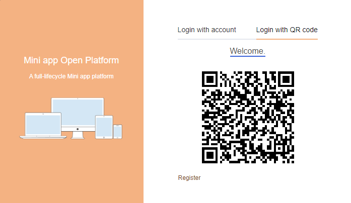

2. Scan the QR code on the Super Hub app QR code scanner (located next to the search input at the top of the main page of the app).

Once you scan the QR code you will be redirected to the registration screen. Below is an example of registering as an internal organization:

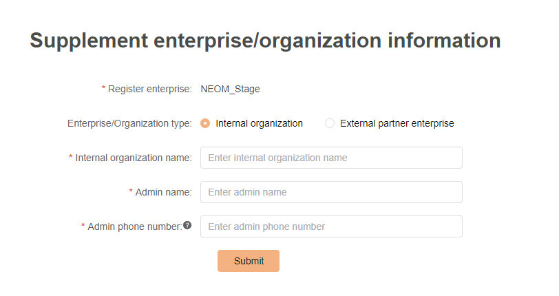

3. Once you fill in the information and submit the form, a success message displays. Now your account is under review.

Once your account is approved (typically, it takes 1 business day), you can log in to the Mini App developer platform.

To log in to the [Mini App developer platform](https://fmp.tmf.stage.neuxnet.com:30001/#/login) after the account is approved, simply scan the QR code on the login page using the QR scanner on the Super Hub app.

### Creating a role on the Mini App developer platform

Once you log in to the Mini App developer platform, you need to create a new role by following the below steps:

1. From the side menu, click  `Role management`:

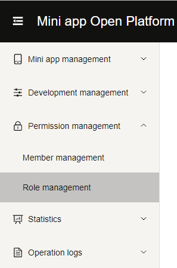

2. From the `Role management` page, select `+ Add role`.
3. Once prompted with the role creation dialog, enter the name you want for the role and the permissions you want to add to the role:

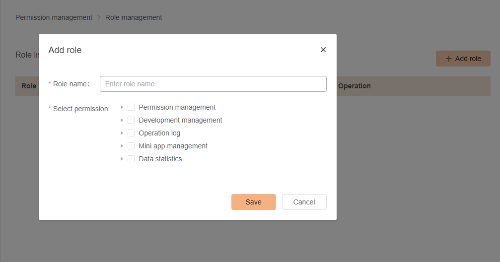

4. Click `Save` to add the role and you can start adding developers to the platform.

### Adding developers to the Mini App developer platform

To add developers to the platform, follow the below steps:

1. Select `Member management` from the side menu.
2. Once the page is loaded, click`+ Add member`.

The following prompt displays:

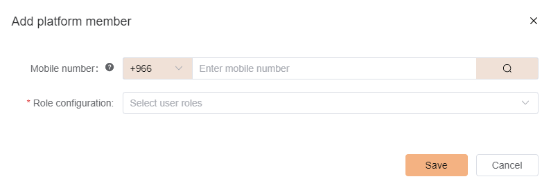

3. Enter the number of the developer registered on the Super Hub app and click the search button. Once the user avatar and name are shown, select the role you created in the previous step from the drop-down menu.

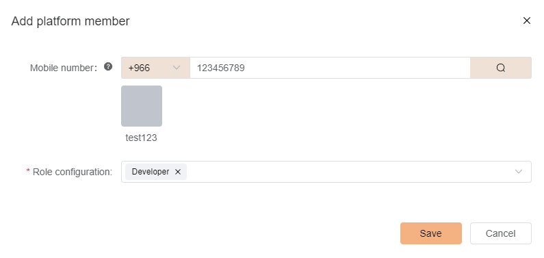

After you click save, the member will be added to the developer platform.

Next, you need to add the user as a developer on the same page. For this follow the below steps:

1. Click `Developer` tab and then click `+ Add member`. 

The following prompt displays:

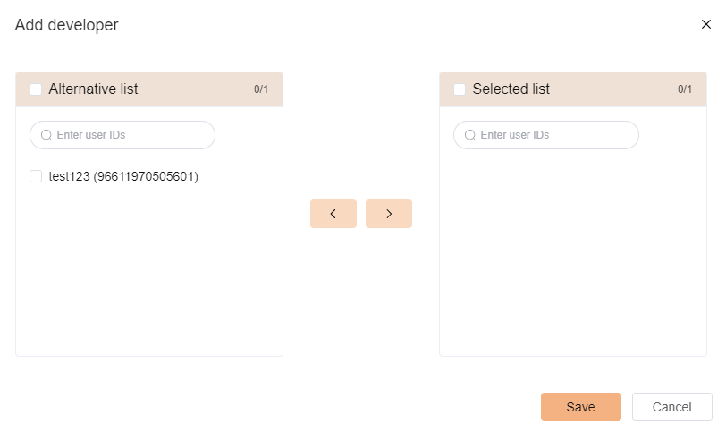

2. Select the developer from the list on the left, then click on the `>` button then click on `Save`.

Now the developer is added, and he can login to the IDE (Super Hub Mini App Studio).

### Creating a new Mini App

In order to start a project in the IDE you first need to create the Mini App on the developer platform by following the below steps:

1. From the side menu click `My mini app`:

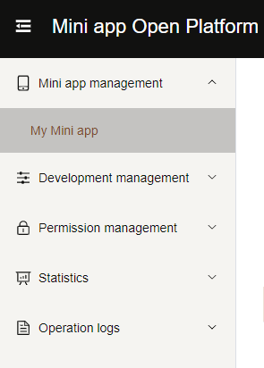

2. Click the `+ Add Mini app` button.

You will be prompted with the following dialog to add the Mini App details:

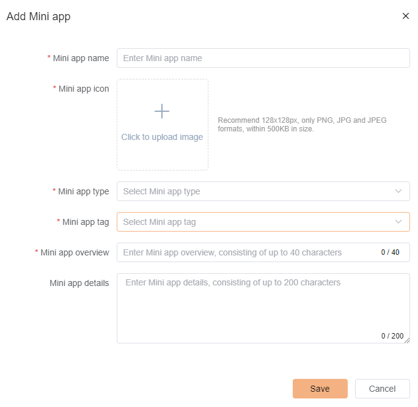

Once you are done entering the Mini App details and click `Save` your Mini App is created. You can start working on it on the Super Hub Mini App studio.

### Downloading the Super Hub Mini App Studio

You can download the IDE (Super Hub Mini App Studio) from this link for MacOS and from this link for Windows, you will need to login to the IDE using the Super Hub app.

Once you open the Super Hub Mini App studio, you will need to login. 

In order to login using a QR code, follow the below steps:

1. Open the QR code scanner on the Super Hub app and scan the QR code on the IDE.

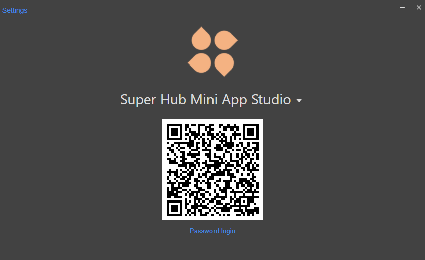

Once you are logged in, you will be prompted to select your organization.  

2. Select your organization.  You will be able to see the start screen:

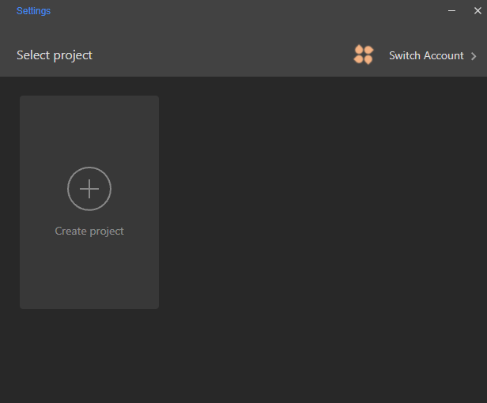

### Creating a new project on the IDE

Follow the below steps to create a new project on the IDE:

1. Click `Create project` to connect the Mini App you previously created to the IDE and start working on it:
2. Enter the Directory, App ID and Name of your project.

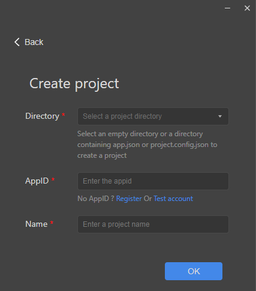

- **Directory**: Select a directory on your local machine
- **AppID**: Enter the app ID provided to you from the developer portal when you created the Mini App on the portal
- **Name**: Enter the name of the project

Once you enter the details and click `OK` you should be able to see the Mini App on the welcome screen:

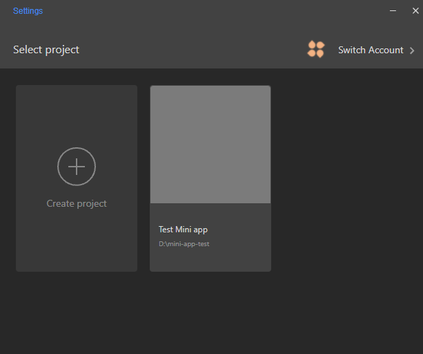

3. Click the newly created Mini app project and you should be able to see the project loaded in the IDE:

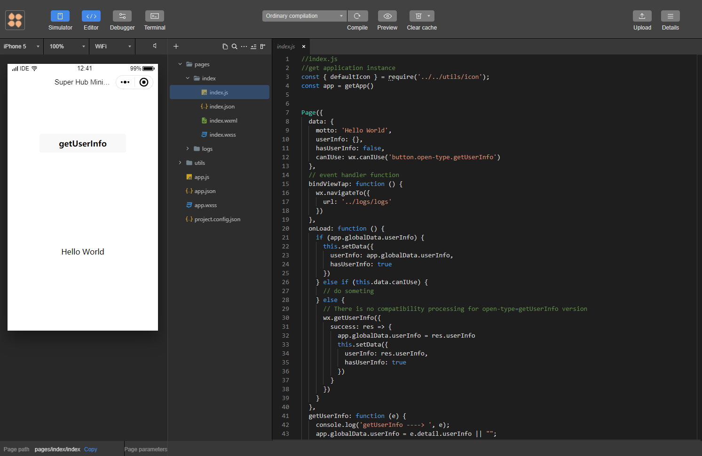

Now you are ready to start working on your first Mini App! happy coding :)
