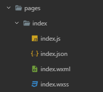

# Quick guide
***
Now that you have created a developer account, downloaded the IDE and started a project, you must have some Mini App development knowledge.

### Technologies used in developing Mini Apps:

#### 1. JavaScript

For security reasons, JS code cannot be dynamically executed in Mini Programs. In other words:

- JS code cannot be executed via eval.
- No functions can be created with new Function.

#### 2. WXML

Template language based on HTML5 with additional components like `<camera>`.

#### 3. WXSS

Styling language similar to CSS and it supports imports.

### Mini App page structure

In order to create a Mini App page, you will have to work with four different file types:

| File       | Extension | Required | Purpose                               |
| :--------- | :-------- | :------- | :------------------------------------ |
| JavaScript | .js       | Yes      | Holds the business logic of the page. |
| WXML       | .wxml     | Yes      | Holds the structure of the page.      |
| WXSS       | .wxss     | No       | Holds the styling of the page.        |
| JSON       | .json     | No       | Holds the configurations of the page. |

After creating the above files, you will be able to start developing your page. Please note that the page needs to be registered in the `app.json` file in order to be identified.



### JavaScript file structure

```javascript
// javascript
// page.js
Page({
  data: {
    username: "test user"
  },
  onLoad: function() {
    console.log("on page loaded")
  },
  customMethod() {
    console.log("This is a custom method")
  }
})
```

As shown in the example above, pages are constructed using the `Page` function call, and its data, custom methods and life cycle methods are passed using an object.

### Data mapping between UI and business logic

In order to pass data from the business logic (JavaScript) to the UI (WXML), the passed data should be declared in the `Page`  method call object, then it can be referenced in WXML inside 2 curly brackets : `{{dataToBeInjected}}`:

```javascript 
// page.js
Page({
  data: {
    username: "test user"
  }
})
```
```xml 
<!-- page.wxml -->
<view>
  <text>{{username}}</text>
</view>
```

In order to pass events from UI (WXML) to the business logic (JavaScript), a custom method should be declared on the `Page` method call object, then it can be bounded from WXML:

```javascript 
// page.js
Page({
  data: {},
  onButtonTapped: function() {
    console.log("on button tapped")
  }
})
```
```xml 
<!-- page.wxml -->
<view>
  <button bindtap="onButtonTapped">Click Me</button>
</view>
```

### Changing data during runtime

When you want to change the data declared in the `Page`  method call object, you need to call `this.setData()` and provide it with the new data value:

```javascript
// javascript
// page.js
Page({
  data: {
  	welcomeMessage: "Hello"
  },
  onButtonTapped: function() {
    this.setData({
    	welcomeMessage: "Howdy"
    })
  }
})
```
```xml
<!-- page.wxml -->
<view>
  <text>{{welcomeMessage}}</text>
  <button bindtap="onButtonTapped">Click Me</button>
</view>
```

Once `this.setData()` is called, the changes will be reflected on WXML directly.

### Making the Mini App interactive

Of course, Mini Apps need to do more than displaying data and feeding back events from UI the business logic, therefore, the global `wx` object exists. its available across all JavaScript files and it can be used to do various actions on the Mini App, you can see the full list of the `wx` object API references in our [APIs](../../APIs/basics-api) section.

Functionality you can achieve using the global `wx` object includes and are not limited to the following:

1. Making an API request.
2. Retrieving the user's location.
3. Navigating to another page within the Mini App.
4. Using the device native capabilities (bluetooth, NFC, Wifi ...etc).
