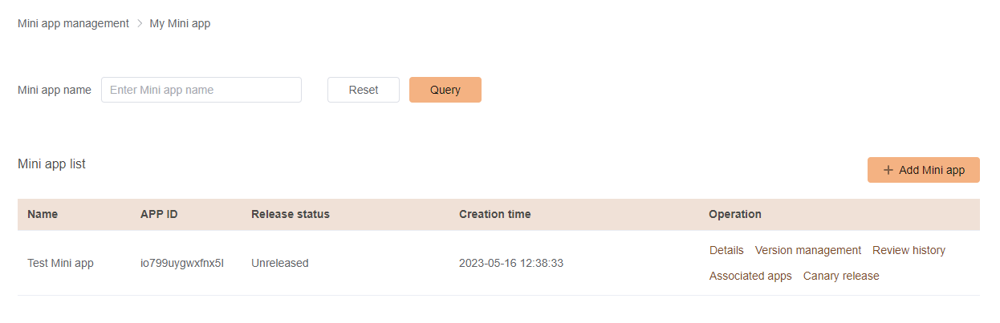

# Managing Mini apps
***
From the side menu, click on `My Mini app`, a page like the below should show:

### Editing Mini App details

You can edit the Mini App details such as name, icon and overview, by clicking on the `Details` action then clicking on the `Edit` button, you will be prompted with a form to edit your Mini App details, once you submit the form, the changes will not take effect immediately, they will be reviewed by our team once a new version of the Mini App is submitted.

### Mini App version management

You can manage the versions of your Mini App as follows:

- **Online version: ** version that is currently online and accessible to users.
- **Release approved version: ** version the was submitted for release and approved but not yet released.
- **Platform review version: ** version currently under review by our team.
- **Development version: ** version used for development purposes.

### Associating a mini app with a Super App

You can select the Super App that you want to associate your Mini App with from this section, please note that you need to submit a version for release in order to associate your Mini App with a Super App

### Canary release

From this section you can add a task to release your Mini App to a controlled group of users.
